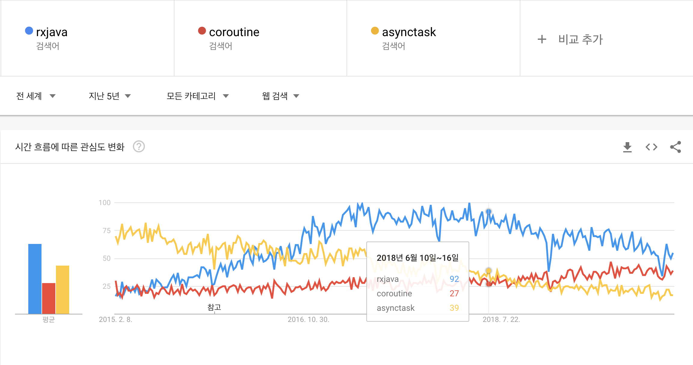

# Rxjava Overview

### What is RxJava
RxJava는 ReactiveX 라이브러리의 Java버전이다. 

ReactiveX는 observable sequence를 사용하여 비동기와 이벤트 기반의 프로그램을 작성할 수 있는 라이브러리이다.

> ReactiveX is a library for composing asynchronous and event-based programs by using observable sequences.

그럼 안드로이드 개발자들은 다음과 같은 의문점을 가져야한다.

RxJava가 비동기 작성에 최선인가?

안드로이드 내에서 비동기를 처리하는 방식은 여러가지가 있다.
대표적으로 AsyncTask, RxJava, Coroutine 등이 있으며 (그 외는 추후에 찾아보는 걸로..), 이 중에 왜 우리는 프로젝트에 Rx를 도입하려는지 충분한 설득력을 갖춰야한다.

### Why RxJava

이 글을 작성하고 있는 시점에 AsyncTask는 이미 deprecated된 상태이기때문에, 그 단점을 늘어놓지 않더라도 선택에서 제외하기에 충분하다.

>Google의 AsyncTask Deprecation에 대한 Offical Announment  AsyncTask는 UI Thread를 사용하는 것을 쉽게하였다. 하지만 대부분의 사용은 데이터를 UI와 묶는 것이였으며, 이것은 Context 누수, Callback 누락, 구성 변경 시 충돌을 야기했습니다. 또한 플랫폼 버젼별로 동작이 달랐으며, doInBackground에서 exception을 일으키지 않았고, Executors를 직접적으로 다루는 기능들을 제공하지 않았습니다.   AsyncTask was intended to enable proper and easy use of the UI thread. However, the most common use case was for integrating into UI, and that would cause Context leaks, missed callbacks, or crashes on configuration changes. It also has inconsistent behavior on different versions of the platform, swallows exceptions from doInBackground, and does not provide much utility over using Executors directly.

RxJava vs Coroutine

1.트랜드 

실질적으로 프로그래머는 특정 라이브러리나 프레임워크에 의존하여 코드를 작성할 때, 의존성에 대한 것을 끊임없이 고민해야한다. 만약 사용하던 라이브러리나 프레임워크가 더 이상 유지보수되지 않고, 사용하는 프로그래머가 없다면 시장에서 곧 잊혀기때문이다. 이러한 의미에서 현재 가장 활발하게 사용되고 있는 RxJava를 선택했다. 이는 대한민국 내 안드로이드 구인구직 공고에서도 RxJava가 많은 기업의 우대사항인 것 또한 한몫했다. 

2.라이브러리 vs 원론

RxJava와 Coroutine은 비동기처리를 하기 위한 도구라는 점은 같으나, 근본적으로 비교할 수 있는 대상은 아니라고 생각한다. Rx는 [마이크로소프트](https://docs.microsoft.com/en-us/previous-versions/dotnet/reactive-extensions/hh242985(v=vs.103)?redirectedfrom=MSDN)에서 더 복잡한 요구사항을 처리해야하는 클라이언트를 위해 옵저버 패턴 + LINQ 스타일 문법을 적용하여 만든 라이브러리고, 이를 JVM 계열로 Netflix Tech Team이 옮긴 것이 RxJava이다.

이에 반해 [Coroutine](https://ko.wikipedia.org/wiki/%EC%BD%94%EB%A3%A8%ED%8B%B4)은 루틴의 일종으로서, 서브 루틴과 메인 루틴의 경계가 모호한, 서로가 서로를 호출할 수 있는 루틴들의 상호 연계를 말하는 것으로 해당 개념은 1958년부터 존재했다. 따라서 코루틴은 안드로이드에서만 누릴 수 있는 특혜는 아닌 것이다. 실제로 필자는 유니티에서 코루틴을 사용해본 경험이 있다.

이제 답은 정해졌다. RxJava는 라이브러리이기때문에 누군가에 의해 지속적으로 유지보수되고 있으며, 대부분 필요한 기능들을 이미 정의가 되어있다. 하지만 Coroutine는 좀 더 원론적인 개념으로서 적용 범위는 방대하지만 필요한 기능을 제공해주지 않는다면 구현을 해야한다. 

본인의 가치판단에 의해서 사용하면 되겠다.

### Concept

Rx의 컨셉은 `데이터 스트림`과 `구독`, `데이터 변경`이다. 
그리고 그 과정에서 사용되는 `Subject`, `Scheduler` 등의 개념도 등장한다.

데이터 스트림 (rxjava 2.2.17 기준)

| 데이터 스트림 | 기능 |
| :---: | :---: |
| Observable | Rx의 가장 기본적인 데이터 스트림으로, 다중 item 방출을 지원하지만, backpressure를 지원하지 않는다. |
| Single | 하나의 item을 방출하는 데이터 스트림이다. |
| Flowable | Rxjava2에서 Observable의 non-backpressure를 해결하기 위한 대안으로 나온 스트림이다. |
| Maybe | 하나 또는 0개의 item을 방출할 수 있는 데이터 스트림이다. Rxjava2에서부터는 null을 방출할 수 없기때문에 대안책으로 사용된다. |
| Completable | item의 방출없이 오직 해당 성공과 에러를 표시만 하는 데이터 스트림이다. |

transform (변환 오퍼레이터)
| 오퍼레이터 | 기능 |
| :---: | :---: |
| Buffer | Observable의 item들을 일정 주기를 기점으로 bundle에 담아 한번에 배출합니다. | 
| FlatMap | Observable에서 배출된 item 하나하나를 Observable로 감싸고, 각 item을 다시 한번 배출합니다.|
| GroupBy | 기존의 Observable을 key에 의해 재조직된 Obeservable들로 묶어 배출한다. |
| Map | 각 item에 사용자가 정의한 function을 적용하여 배출한다. |
| Scan | 이전에 방출된 값과 다음의 item을 같이 function에 전달한다. |
| Window | 일정 주기를 기점으로 Observable의 item들을 나누어 Observable window에 담고, 해당 window를 한 번에 배출합니다. |

추후 업데이트
- create (생성 오퍼레이터)
- filter (필터링 오퍼레이터)
- combine (합성 오퍼레이터)
- error (에러 핸들링 오퍼레이터)

